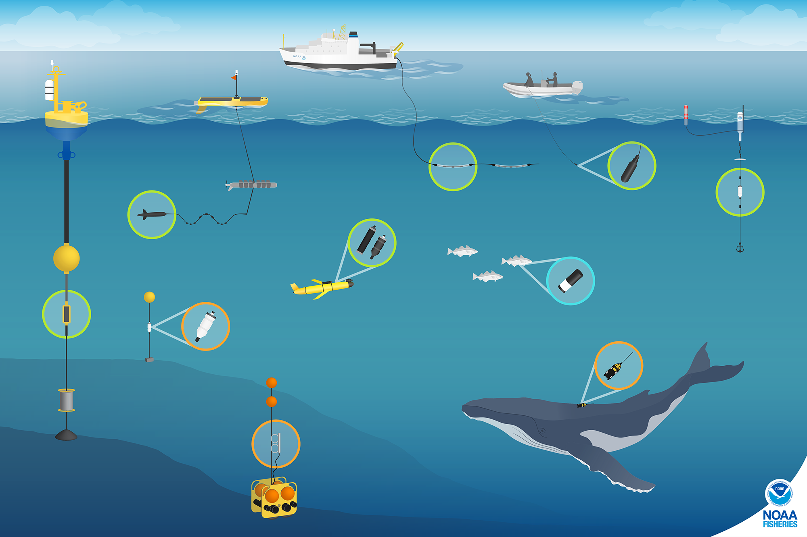

{width="625"}

## Moored Recorders

PALs

[EARs](https://oceanwidescience.org/ecological-acoustic-recorder-ear/)

[SoundTraps](https://www.oceaninstruments.co.nz/)

## Biologging Tags

[Digital Acoustic Recording tags (DTAGS)](https://www2.whoi.edu/site/marinemammalbehaviorlab/dtag/)

## Other Instruments

[Towed Arrays](https://sael-swfsc.github.io/SAEL-lab-manual/content/Hardware_Towed-Hydrophone.html)

[C-PODS](https://www.chelonia.co.uk/c-pod/)

[Sonobuoys](https://sael-swfsc.github.io/SAEL-lab-manual/content/Hardware_Sonobuoys.html)

Dipping hydrophones
