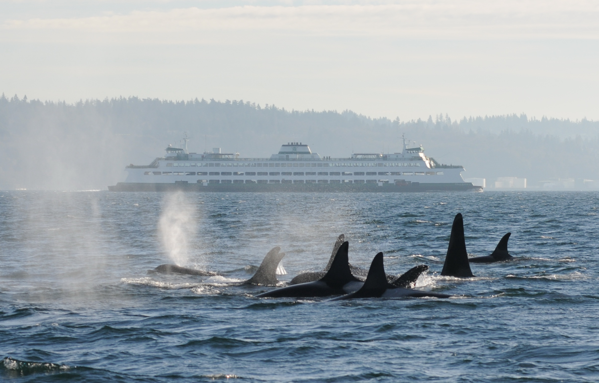

### Southern Resident Killer Whale Research and Recovery

-   [SRKW population status, management, recovery efforts, and outreach and education](https://www.fisheries.noaa.gov/west-coast/endangered-species-conservation/southern-resident-killer-whale-orcinus-orca)

-   [SRKW Research](https://www.fisheries.noaa.gov/west-coast/science-data/southern-resident-killer-whale-research-pacific-northwest)

-   [Story Map](https://storymaps.arcgis.com/stories/085aea554ca4472bb12b6b5d5cec3cc1)

-   [Web Stories & Articles](https://www.fisheries.noaa.gov/search?oq=southern+resident+killer+whale)

