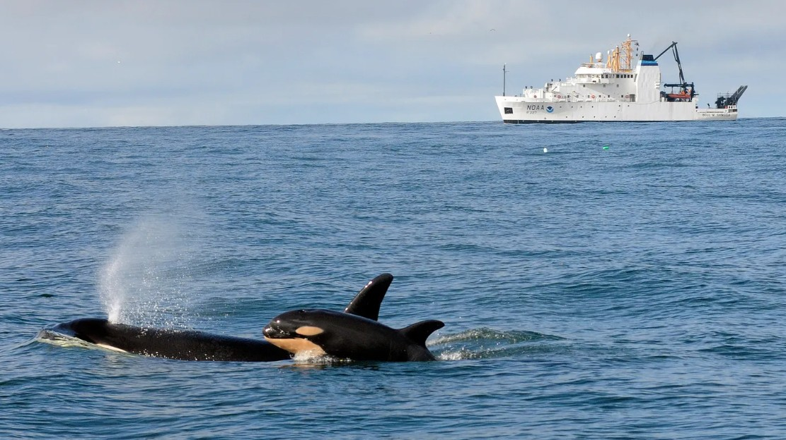

::::: columns
::: {.column width="55%"}
The [Marine Mammal Ecology Team](https://www.fisheries.noaa.gov/west-coast/science-data/marine-mammal-ecology-pacific-northwest) conducts research using passive acoustic monitoring to support NOAA's management needs. We are part of the Conservation Biology Division at [NOAA's Northwest Fisheries Science Center](https://www.fisheries.noaa.gov/about/northwest-fisheries-science-center) in Seattle, Washington.

This lab manual serves as a handbook for the information to support our science.
:::

::: {.column width="45%"}
{fig-alt="" fig-align="center"}
:::
:::::

## Team Members

[Brad Hanson](https://www.fisheries.noaa.gov/contact/brad-hanson-phd), MMET Team Leader, Wildlife Biologist

[Marla Holt](https://www.fisheries.noaa.gov/contact/marla-holt-phd), Research Wildlife Biologist

[Candice Emmons](https://www.fisheries.noaa.gov/contact/candice-emmons), Research fish Biologist

Arial Brewer, Bioacoustician and Data Manager

## Additional NMFS PAM Lab Manuals

-   [PIFSC: Pacific Islands Fisheries](https://pifsc-protected-species-division.github.io/CRP_PAM_Manual/)

-   [SWFSC: Southwest Fisheries](https://pifsc-protected-species-division.github.io/CRP_PAM_Manual/))

-   [AFSC: Alaska Fisheries](https://noaa-afsc.github.io/AFSC-MML-PAM-Lab-Manual/){target="_blank"}

-   [SEFSC: Southeast Fisheries](https://sefsc.github.io/SEFSC-PAM-Lab-Manual/){target="_blank"}

-   [NEFSC: Northeast Fisheries](https://nefsc.github.io/NEFSC_PAB_lab_manual/){target="_blank"}

-   [National PAM Network](https://nmfs-ost.github.io/PAM_National_Network/){target="_blank"}
